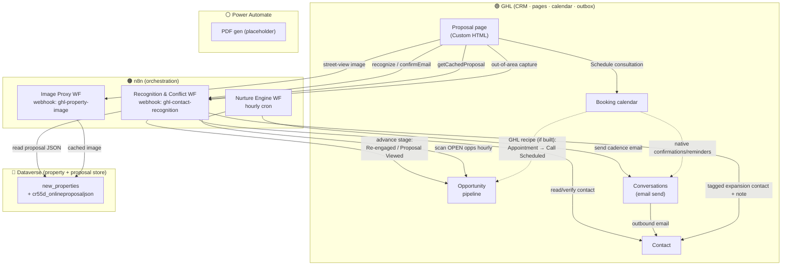

# PropScore Pipeline Map — After the Proposal Is Created

**What runs where once a property has a proposal.** This is the companion to
`COMMUNICATIONS.md` (which covers *emails*); this file covers the **workflow
orchestration** and, specifically, the **n8n ↔ GHL boundary** that keeps
tripping people up.

_Last updated: 2026-07-13._

---

## The four systems (who owns what)

| System | Role | Owns |
|---|---|---|
| **GHL** (GoHighLevel) | CRM + front-end host + mail sender | Hosts the pages (intake widget, proposal page) as Custom HTML; **Contacts**; the **Opportunity pipeline** (stages); the **booking calendar**; **Conversations** (all prospect email actually sends from here); custom values; Owner↔Property associations; any native GHL Workflow "recipes" you build. |
| **n8n** | Orchestration brain | Every decision and cross-system write. Creates/updates GHL records, advances opportunity stages, reads/writes Dataverse, calls Power Automate, and tells GHL when to email. GHL and Dataverse never talk to each other directly — **n8n is the only thing that touches both.** |
| **Dataverse** (Microsoft Dynamics) | Property system-of-record | `new_properties` rows: fee, scores, RentCast JSON, the cached proposal (`cr55d_onlineproposaljson`), the GHL contact link, and the `fee_calc_log` table. **The proposal the customer sees is served from here, not from GHL.** |
| **Power Automate** | External compute | Two flows n8n calls over HTTP: **Fee Calc** (live, every submission) and **PDF generation** (placeholder — not wired). Definitions live in Power Platform, invisible to n8n. |

> **The one-line answer to "n8n vs GHL":** GHL holds the *people, the pipeline,
> the calendar, and the outbox*. Dataverse holds the *property and its
> proposal*. **n8n is the glue** — it makes every write to both and every
> stage move. If something computed or moved, it was n8n; if a human record,
> a deal card, an appointment, or an email lives somewhere, it's GHL.

---

## "Proposal created" = the moment this happens

The proposal comes into existence at the **tail of the Main Pipeline**, on the
consented scoring submission (`webhook/ghl-property-scoring`). In one run n8n:

1. Calls **Power Automate Fee Calc** → gets the management rate.
2. Generates the AI report (Anthropic) + OIA scoring.
3. **Writes the proposal to Dataverse** (`Store Proposal` → `cr55d_onlineproposaljson`).
4. **Upserts the GHL Contact**, creates/finds the **GHL Property record**,
   **associates** them (Owner↔Property), logs a **consent note**.
5. **Creates the GHL Opportunity** in **New Proposal**.
6. (Would trigger PDF generation — placeholder, does nothing today.)
7. Responds to the widget, which **redirects to the proposal page**.

Everything below is what happens **after** that.

---

## The post-proposal flow

Legend: **solid** = n8n-driven; **dotted** = GHL-native (no n8n involved).

---

## Step by step, after creation

| # | Trigger | Runs in | Touches | Result |
|---|---|---|---|---|
| 1 | Owner opens proposal page | GHL page → **n8n Recognition** (`recognize` → `confirmEmail`, or the fresh-submission handoff) | Dataverse (proposal JSON), GHL (contact verify) | Proposal renders from the **Dataverse** cache |
| 2 | Email confirmed on a returning visit | **n8n Recognition** | GHL Opportunity | Stage → **Re-engaged** |
| 3 | Proposal actually loaded (`getCachedProposal`) | **n8n Recognition** | GHL Opportunity | Stage → **Proposal Viewed** |
| 4 | Street-view/image request | **n8n Image Proxy** | Dataverse image cache, Google (server-side) | Image returned; no key exposed |
| 5 | Every hour | **n8n Nurture Engine** | GHL Opportunities (read), GHL Conversations (send) | ≤1 cadence email per open opp (receipt / nudges / resume / questions / case-study), ledgered in `nurture_log` |
| 6 | Visitor books a time | **GHL calendar (native)** | GHL appointment; optional GHL recipe → Opportunity | Confirmations/reminders sent **by GHL**; stage → **Call Scheduled** if you built that recipe |
| 7 | Out-of-area email capture | **n8n Recognition** | GHL contact + tags + note | `expansion-market` / `expansion-<state>` tagged contact |
| 8 | Email confirm fails, phone left | **n8n Recognition** | GHL contact + conflict note | Human follow-up flagged |

---

## n8n workflows involved (post-proposal)

| Workflow (n8n) | ID | Fires on | Reaches into |
|---|---|---|---|
| **Main Pipeline** (tail only, post-proposal) | `pKLkd1TNccAKf8Sx` | scoring submission | GHL contact/opp/association/consent, Dataverse, Power Automate |
| **Recognition & Conflict** | `qrBE83G5T65YHbnI` | proposal-page actions (`recognize`, `confirmEmail`, `getCachedProposal`, `conflict`, `expansion`) | Dataverse (proposal read), GHL (contact + opportunity stages) |
| **Proposal Nurture Engine** | `SmUd5enJvJ03pACE` | hourly cron | GHL opportunities (read) + Conversations (send); `nurture_log` |
| **Image Proxy** | `1R4o6Fq24RlOjWga` | `ghl-property-image` | Dataverse image cache + Google (server-side) |
| _(Site-selected Routing_ `JoypA2AkglKBsIGh` _and OIA Scoring_ `66sDsDzoRwBYwQlW` _run **before** the proposal exists — listed for completeness.)_ | | | |

---

## What is GHL-native (no n8n) — the short list

These are the only moving parts that run **without** n8n after a proposal exists:

- **Booking calendar** confirmations, reminders, cancellations — GHL calendar settings.
- **Won / Lost** stage moves — a human dragging the card in GHL.
- **Any GHL Workflow recipe you build** — e.g. "Appointment booked → Call
  Scheduled," "Proposal Viewed → notify me," conflict-tag task. As of now these
  are **internal notifications** only; none email prospects.

Everything else — stage advances, emails to prospects, record writes,
associations, proposal serving — is **n8n**.

---

## Known gaps (so the map isn't misleading)

- **PDF proposal email is not built.** The Power Automate PDF node is a dead
  placeholder; no proposal PDF is generated or emailed. (See `COMMUNICATIONS.md` §2.)
- **Proposal Updated** stage exists in the pipeline and nurture cadence, but
  nothing moves an opp into it yet — that's the coming **proposal-editing
  process**, which will also re-save the fee/scenario in Dataverse.
- Email verification gate (ZeroBounce) is built but inert pending an egress
  allowlist.
